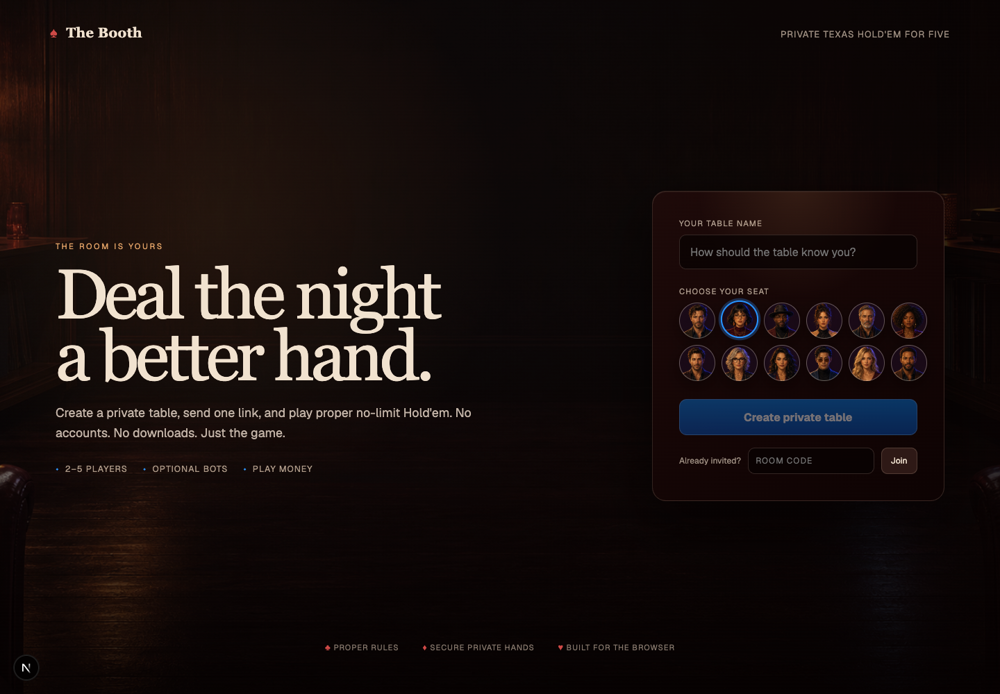
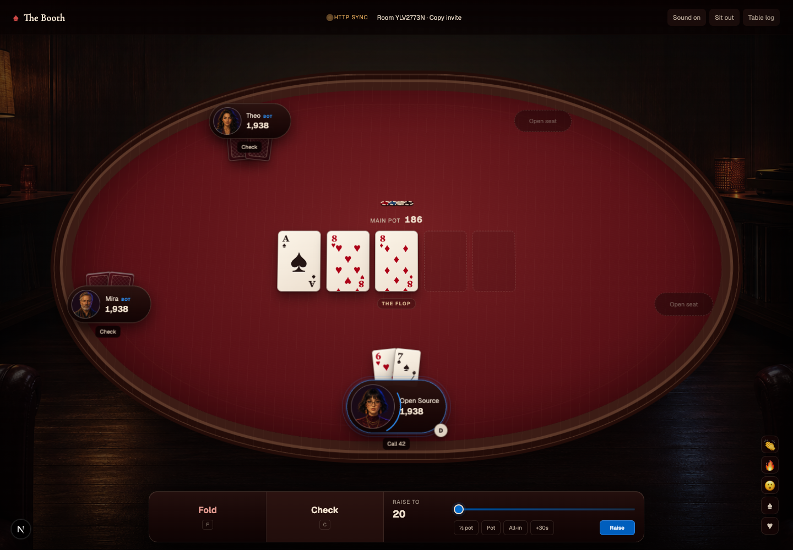
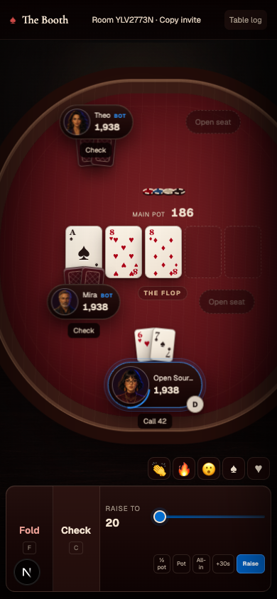
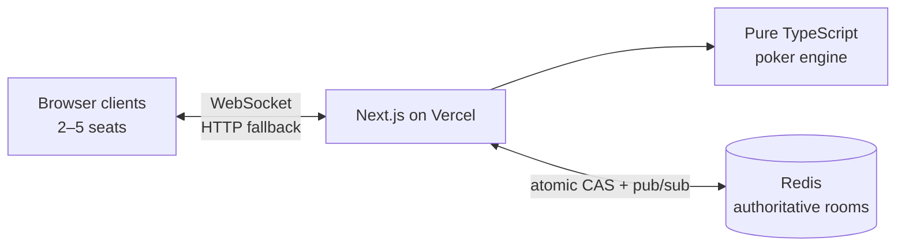

<div align="center">

# ♠ The Booth

### Private-link Texas Hold’em, dressed for the occasion.

A beautifully crafted, real-time poker room for 2–5 players.  
No accounts. No downloads. Create a table, share one link, and deal.

[](https://github.com/rootsec1/poker/actions/workflows/ci.yml)
[](https://nextjs.org/)
[](https://www.typescriptlang.org/)
[](https://vercel.com/new/clone?repository-url=https%3A%2F%2Fgithub.com%2Frootsec1%2Fpoker)
[](LICENSE)

[Quick start](#quick-start) · [Deploy](#deploy-to-vercel) · [Architecture](#architecture) · [Contributing](#contributing)

</div>



## Poker should feel like poker

The Booth pairs a rules-correct no-limit Hold’em engine with an oxblood-felt listening-room aesthetic. Cards have weight. Chips gather into pots. Turns feel immediate. Every table remains private and every hand stays authoritative on the server.



## What’s inside

- **Real multiplayer** — private rooms for two to five human players or bots
- **Proper Hold’em** — blinds, dealer rotation, burn cards, all-ins, minimum raises, short-raise reopening, side pots, split pots, and heads-up rules
- **Tactile presentation** — dealing and flip choreography, chip motion, pot delivery, particles, glow, procedural audio, haptics, and reduced-motion support
- **Reconnect-safe seats** — secure guest identity in an HttpOnly, SameSite cookie
- **Three bot styles** — tight, balanced, and aggressive opponents that receive no hidden information
- **Social table** — reactions, chat, hand history, sound controls, sitting out, rebuys, and host controls
- **Responsive by design** — a complete table experience across desktop, tablet, and phone
- **Vercel native** — one Next.js app, native WebSockets, HTTP fallback, and Redis-backed room state

<p align="center">
  
</p>

## Quick start

Requirements: [Node.js 24](https://nodejs.org/) and npm.

```bash
git clone https://github.com/rootsec1/poker.git
cd poker
npm install
npm run dev
```

Open [http://localhost:3000](http://localhost:3000), create a room, and add a bot or share the generated room link.

`next dev` intentionally uses an in-process room store when `REDIS_URL` is absent, so no infrastructure is needed for local UI and game testing. To exercise the full Vercel runtime:

```bash
npm i -g vercel
vercel link
vercel env pull .env.local
npm run dev:vercel
```

## Deploy to Vercel

<div align="center">

[](https://vercel.com/new/clone?repository-url=https%3A%2F%2Fgithub.com%2Frootsec1%2Fpoker)

</div>

1. Import this repository using the button above.
2. In the Vercel project, install a **Redis** provider from the [Vercel Marketplace](https://vercel.com/marketplace?category=storage&search=redis).
3. Confirm the integration exposes `REDIS_URL` to Production and Preview.
4. Set `NEXT_PUBLIC_BASE_URL` to the production origin, for example `https://poker.example.com`.
5. Deploy, then verify `https://YOUR_DOMAIN/api/health`.

That is the entire production stack. [`vercel.json`](vercel.json) enables Fluid Compute for the native WebSocket route; no Dockerfile, custom server, database migration, or second application is required.

## Architecture



Every room mutation includes a command ID and expected version. A small Redis Lua compare-and-set operation accepts exactly one valid transition, then publishes the new room version. Recipient-specific serialization prevents the deck, tokens, burn cards, bot-private inputs, and opponents’ live hole cards from leaving the server.

If a WebSocket reconnects or is unavailable, the client automatically continues through the matching HTTP endpoints. Rooms remain ephemeral and expire after 30 minutes without connected players.

## Configuration

Copy [`.env.example`](.env.example) to `.env.local` when running with Redis.

| Variable | Required | Purpose |
| --- | --- | --- |
| `REDIS_URL` | Production | Authoritative room state, atomic mutations, and pub/sub |
| `NEXT_PUBLIC_BASE_URL` | Production | Canonical origin used in invite links and request validation |

Do not commit `.env.local`; environment files are ignored by default.

## Verification

```bash
npm run lint
npm run typecheck
npm test
npm run test:exhaustive
npm run build
```

The test suite covers hand evaluation, betting order, legal raises, folded contributions, side pots, ties, odd chips, privacy boundaries, reconnect behavior, and server room commands. The exhaustive evaluator check verifies all **2,598,960** possible five-card hands against canonical category frequencies.

## Project layout

```text
src/
├── app/                 # App Router pages and API routes
├── components/          # Lobby, table, cards, seats, and effects
└── lib/
    ├── poker/           # Pure game rules, evaluator, bots, and views
    └── server/          # Redis store, room commands, auth, and transport
tests/                   # Unit, privacy, room, and exhaustive checks
```

## Product boundaries

The Booth is play-money software. It has no deposits, withdrawals, permanent balances, public lobby, or account system. Room state is intentionally session-scoped. Do not use it for real-money gambling.

## Contributing

Issues and pull requests are welcome.

1. Fork the repository and create a focused branch.
2. Add or update tests for behavior changes.
3. Run the full verification suite.
4. Open a pull request explaining the player-facing outcome and rules impact.

Please keep changes small, rules-correct, and respectful of player privacy.

## License

[MIT](LICENSE) © 2026 Abhishek Murthy
